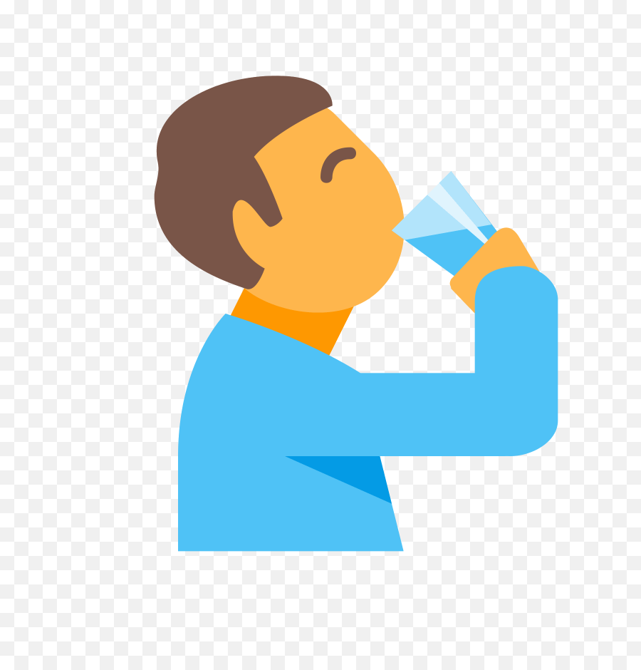

<p align="center">
 </a>
</p>

<h3 align="center">Hydration Reminder</h3>

<div align="center">

[]()
[](https://github.com/kylelobo/The-Documentation-Compendium/issues)
[](https://github.com/mmcmd/HydrationReminder/pulls)
[](https://www.gnu.org/licenses/gpl-3.0)
[](https://www.codefactor.io/repository/github/mmcmd/hydrationreminder)
</div>

---

<p align="center"> A PowerShell module designed to remind you via Windows notification to drink some water every so often in order to stay hydrated!
    <br> 
</p>

## 📝 Table of Contents

- [About](#about)
- [Getting Started](#getting_started)
- [Deployment](#deployment)
- [Usage](#usage)
- [Built Using](#built_using)
- [Contributing](../CONTRIBUTING.md)
- [Authors](#authors)
- [Acknowledgments](#acknowledgement)

## 🧐 About <a name = "about"></a>

A fairly simple module to remind you (by default every hour) to drink some water in order to stay hydrated. Inspired by a Twitch [Hydration bot](https://github.com/Vuurvos1/stayHydratedFox)

## 🏁 Getting Started <a name = "getting_started"></a>

### Prerequisites

- Powershell 5.1 or higher
```powershell
PS C:\> $PSVersionTable


Name                           Value
----                           -----
PSVersion                      5.1.19041.1237
PSEdition                      Desktop
PSCompatibleVersions           {1.0, 2.0, 3.0, 4.0...}
BuildVersion                   10.0.19041.1237
CLRVersion                     4.0.30319.42000
WSManStackVersion              3.0
PSRemotingProtocolVersion      2.3
SerializationVersion           1.1.0.1

```

- [BurntToast PowerShell module from the PowerShell gallery](https://www.powershellgallery.com/packages/BurntToast) (must be installed from an elevated prompt)
```powershell
PS C:\Windows\System32> Install-Module BurntToast
```

- Windows 10/Windows Server 2019 or higher

### Installing

- This module can be obtained from the PSGallery. Simply run the following command in an elevated command prompt:
```powershell
PS C:\Windows\System32> Install-Module HydrationReminder
```

## 🎈 Usage <a name="usage"></a>

The commands from this module can be found by running `Get-Command -Module HydrationReminder`

Running `Get-Help` on any of the commands will provide additional examples and details on how to use the command


Parameter list and description for `Start-HydrationReminder`:
Parameters | Type | Functionality
-----------|------|---------------
ReminderInterval | Integer | Interval in minutes at which you will receive a notification to drink. Default is 60 minutes (1 hour)
DailyWaterInstake | Integer | Amount of daily water intake needed (in mL). Default is 2000mL (2L)
Duration | Integer | Amount in hours you want to be reminded for. Default is 16 hours (average amount of time a human is awake for before going to sleep)


`Stop-HydrationReminder` can be run if you'd like to stop any active hydration reminder jobs


## 🚀 Deployment <a name = "deployment"></a>

It is encouraged to create a task with Task Scheduler to run the command `Start-HydrationReminder` on logon.
This can be done with the `Register-HydrationReminderTask` command.

`Start-HydrationReminder` can be used to start the script
`Stop-HydrationReminder` can be used to stop it
`Unregister-HydrationReminderTask` removes the task created by `Register-HydrationReminderTask` 

## ⛏️ Built Using <a name = "built_using"></a>

- [PowerShell](https://docs.microsoft.com/en-us/powershell/scripting/overview?view=powershell-5.1)
- [BurntToast](https://github.com/Windos/BurntToast)
- [VSCode](https://code.visualstudio.com/)

## ✍️ Authors <a name = "authors"></a>

- [@mmcmd](https://github.com/mmcmd) - Idea & Initial work

See also the list of [contributors](https://github.com/mmcmd/HydrationReminder/contributors) who participated in this project.

## 🎉 Acknowledgements <a name = "acknowledgement"></a>

- [BurntToast](https://github.com/Windos/BurntToast) for simplifying sending Windows notifications
- Inspired by Twitch's [Hydration bot](https://github.com/Vuurvos1/stayHydratedFox)
